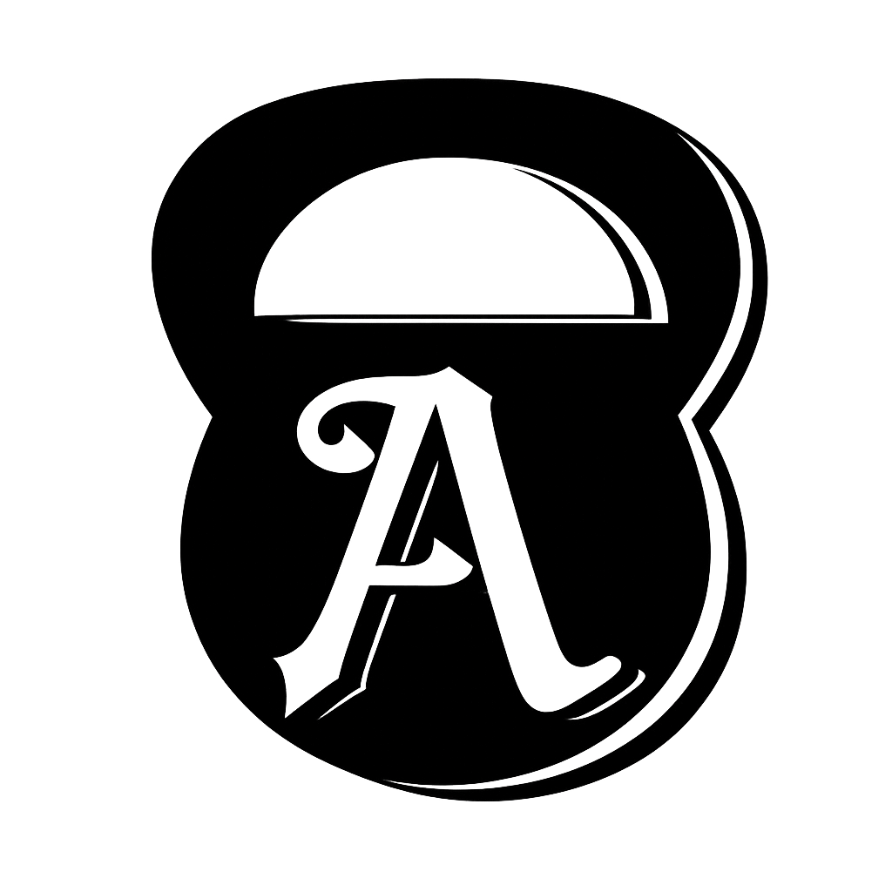

# Agil

Agil is an iOS app for the gym: log your lifts and cardio, track nutrition, and watch your
progress turn into badges, ranks, and a profile card you can share with friends.

## What Agil is trying to do

- **Make consistency feel rewarding.** Training earns achievements across seven tiers
  (Bronze → Legendary), a chess-themed Strategist rank, and coins for themes and card styles.
  Credit only lands when you finish a workout, so it reflects real work.
- **Keep logging fast.** Presets and templates, per-set check-offs, and cardio tracked straight
  from the Workouts tab, so the app stays out of the way mid-session.
- **Show progress honestly.** Personal records, monthly recaps, and charts built from what you
  actually logged, with guardrails against implausible entries.
- **Be private by default.** Ghost Mode keeps everything on the device. Friends mode shares
  only your profile card. Never your training history, nutrition, or body data.
- **Grow into a full training companion.** Planned next: body measurements, data
  export/import, and friend leaderboards.

## Building

Requires Xcode and [XcodeGen](https://github.com/yonaskolb/XcodeGen). Targets iOS 16.1+.

```bash
xcodegen generate
open GymApp.xcodeproj
```
